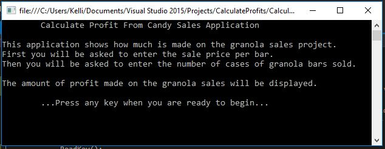
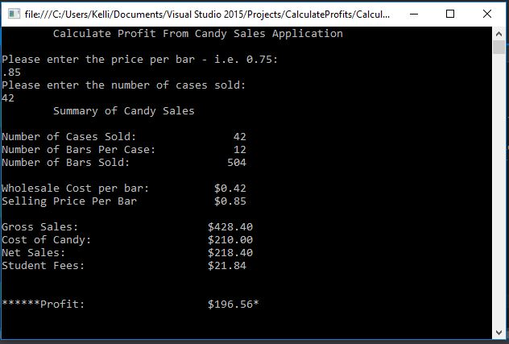

# Profits-From-Sales

C# Application

## Assignment Details
Write a program that computes the amount of money the comouter club will receive from proceeds of their granola bar sales projects. Allow the user to enter the number of cases sold and the sale price per bar. Each case contains 12 bars; each case is purchased at $5.00 per case from a local vendor. The club is required to give the student government association 10% of their earnings. Display instructions to the user about the application. Display all inputs and calculated values. Proceddeds should be formatted with currency. Modularize you solution by writing appropriate methods.

## Output

